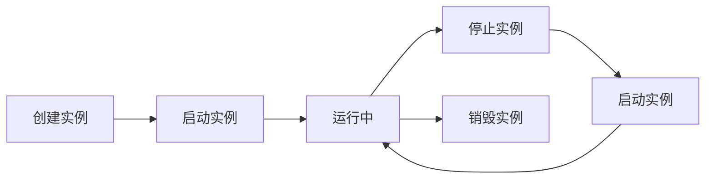

## 基础信息

### API 基础URL

```
https://www.chenyu.cn/api/open/v2
```

### 认证方式

部分API请求都需要在HTTP头中包含认证信息：

```http
Authorization: Bearer YOUR_API_KEY
```

### 请求格式

- **Content-Type**: `application/json`
- **字符编码**: UTF-8
- **请求方法**: GET、POST

### 响应格式

所有API响应都采用统一的JSON格式：

```json
{
  "code": 0,
  "msg": "操作成功",
  "data": {
    // 具体的响应数据
  }
}
```

## API 概览

<CardGroup cols={2}>
  <Card title="实例管理" icon="server" href="/api-reference/instance/list">
    创建、启动、停止、重启GPU实例，管理实例生命周期
  </Card>
  <Card title="账户信息" icon="wallet" href="/api-reference/balance/info">
    查询余额、充值记录、账单明细等账户信息
  </Card>
  <Card title="资源查询" icon="cube" href="/api-reference/gpu/list">
    获取可用Pod、GPU型号、镜像等资源信息
  </Card>
  <Card title="Pod管理" icon="chart-line" href="/api-reference/pod/list">
    获取应用市场Pod列表和相关信息
  </Card>
</CardGroup>

## 核心功能

### 实例管理

管理GPU实例的完整生命周期：



主要接口：
- `POST /api/open/v2/instance/create_by_pod` - 通过Pod创建实例
- `POST /api/open/v2/instance/create_by_image` - 通过镜像创建实例
- `GET /api/open/v2/instance/list` - 获取实例列表
- `POST /api/open/v2/instance/startup` - 启动实例
- `POST /api/open/v2/instance/shutdown_timer` - 停止实例
- `POST /api/open/v2/instance/restart` - 重启实例

### 计费管理

实时监控费用和管理预算：

- `GET /api/open/v2/balance/info` - 查询账户余额
- `GET /api/open/v2/bill/list` - 获取账单详情
- `GET /api/open/v2/recharge/list` - 查询充值记录

### 资源管理

获取平台资源信息：

- `GET /api/open/v2/pod/list` - 获取Pod列表
- `GET /api/open/v2/gpu/list` - 获取GPU列表
- `GET /api/open/v2/image/market/list` - 获取市场镜像列表

## 快速开始

### 1. 获取API Key

登录 [晨羽智云控制台](https://www.chenyu.cn/console/apiServer)，在"API管理"页面创建新的API密钥。


### 2. 初始化客户端

<CodeGroup>

```python Python
import requests

url = "https://www.chenyu.cn/api/open/v2/balance/info"
headers = {
    "Authorization": "Bearer YOUR_API_KEY",
    "Content-Type": "application/json"
}

# 获取账户信息
response = requests.get(url, headers=headers)
balance = response.json()
print(f"账户余额: {balance['data']['balance']} 元")

# 创建实例
create_url = "https://www.chenyu.cn/api/open/v2/instance/create_by_pod"
data = {
    "pod_uuid": "pod_xxx",
    "gpu_uuid": "gpu_xxx",
    "auto_start": 1
}
response = requests.post(create_url, headers=headers, json=data)
instance = response.json()
print(f"实例创建成功: {instance['data']['instance_uuid']}")
```

```javascript JavaScript
const axios = require('axios');

const headers = {
    'Authorization': 'Bearer YOUR_API_KEY',
    'Content-Type': 'application/json'
};

// 获取账户信息
const balanceUrl = 'https://www.chenyu.cn/api/open/v2/balance/info';
const balanceResponse = await axios.get(balanceUrl, { headers });
console.log(`账户余额: ${balanceResponse.data.data.balance} 元`);

// 创建实例
const createUrl = 'https://www.chenyu.cn/api/open/v2/instance/create_by_pod';
const data = {
    pod_uuid: 'pod_xxx',
    gpu_uuid: 'gpu_xxx',
    auto_start: 1
};
const instanceResponse = await axios.post(createUrl, data, { headers });
console.log(`实例创建成功: ${instanceResponse.data.data.instance_uuid}`);
```

```go Go
package main

import (
    "bytes"
    "encoding/json"
    "fmt"
    "io/ioutil"
    "net/http"
)

func main() {
    apiKey := "YOUR_API_KEY"
    
    // 获取账户信息
    balanceURL := "https://www.chenyu.cn/api/open/v2/balance/info"
    req, _ := http.NewRequest("GET", balanceURL, nil)
    req.Header.Set("Authorization", "Bearer "+apiKey)
    req.Header.Set("Content-Type", "application/json")
    
    client := &http.Client{}
    resp, err := client.Do(req)
    if err != nil {
        panic(err)
    }
    defer resp.Body.Close()
    
    body, _ := ioutil.ReadAll(resp.Body)
    fmt.Printf("账户信息: %s\n", string(body))
    
    // 创建实例
    createURL := "https://www.chenyu.cn/api/open/v2/instance/create_by_pod"
    data := map[string]interface{}{
        "pod_uuid":   "pod_xxx",
        "gpu_uuid":   "gpu_xxx",
        "auto_start": 1,
    }
    jsonData, _ := json.Marshal(data)
    
    req2, _ := http.NewRequest("POST", createURL, bytes.NewBuffer(jsonData))
    req2.Header.Set("Authorization", "Bearer "+apiKey)
    req2.Header.Set("Content-Type", "application/json")
    
    resp2, err := client.Do(req2)
    if err != nil {
        panic(err)
    }
    defer resp2.Body.Close()
    
    body2, _ := ioutil.ReadAll(resp2.Body)
    fmt.Printf("创建实例结果: %s\n", string(body2))
}
```

</CodeGroup>

## 状态码说明

### HTTP状态码

| 状态码 | 描述 | 说明 |
|--------|------|------|
| 200 | OK | 请求成功 |
| 400 | Bad Request | 请求参数错误 |
| 401 | Unauthorized | 认证失败 |
| 403 | Forbidden | 权限不足 |
| 404 | Not Found | 资源不存在 |
| 429 | Too Many Requests | 请求过于频繁 |
| 500 | Internal Server Error | 服务器内部错误 |

## 错误处理

### 错误响应格式

```json
{
  "code": 400,
  "message": "请求参数错误",
  "data": {
    "error": "invalid_parameter",
    "details": "pod_uuid参数不能为空",
    "field": "pod_uuid"
  }
}
```


```python
import time
import random

def retry_with_backoff(func, max_retries=3):
    for attempt in range(max_retries):
        try:
            return func()
        except Exception as e:
            if attempt == max_retries - 1:
                raise e
            
            # 指数退避 + 随机抖动
            delay = (2 ** attempt) + random.uniform(0, 1)
            time.sleep(delay)
```

### 当前版本

- **API版本**: v2
- **发布日期**: 2025-08-01

### 安全建议

- **API Key管理**: 将API Key存储在环境变量中，不要硬编码
- **定期轮换**: 定期更新API Key以提高安全性

## 获取帮助

<CardGroup cols={2}>
  <Card title="API文档" icon="book" href="/api-reference/instances">
    查看详细的API接口文档和示例
  </Card>
  <Card title="常见问题" icon="question" href="/faq">
    查看API使用的常见问题和解决方案
  </Card>
  <Card title="联系支持" icon="headset" href="#" onClick="showSupportModal()">
      遇到问题？我们的技术团队随时为您提供帮助
  </Card>
</CardGroup>

---

{/* 联系支持弹框 */}
<div id="support-modal" className="support-modal">
  <div className="modal-content">
    <button className="close-button" type="button">
      <span className="close-icon">×</span>
    </button>
    <div className="modal-header">
      <h3 className="modal-title">联系技术支持</h3>
      <p className="modal-subtitle">扫描下方二维码获取专业技术支持</p>
    </div>
    <div className="qr-code-container">
      
    </div>
    <div className="modal-footer">
      <p>我们的技术团队将为您提供技术支持服务</p>
    </div>
  </div>
</div>