# API 参考

欢迎使用晨羽智云API！我们提供完整的RESTful API接口，帮助您通过编程方式管理GPU实例、监控资源使用和控制成本。

## 基础信息

### API 基础URL

```
https://www.chenyu.team/api/open/v2
```

### 认证方式

所有API请求都需要在HTTP头中包含认证信息：

```http
Authorization: Bearer YOUR_API_KEY
```

### 请求格式

- **Content-Type**: `application/json`
- **字符编码**: UTF-8
- **请求方法**: GET、POST、PUT、DELETE

### 响应格式

所有API响应都采用统一的JSON格式：

```json
{
  "code": 200,
  "message": "操作成功",
  "data": {
    // 具体的响应数据
  }
}
```

## API 概览

<CardGroup cols={2}>
  <Card title="实例管理" icon="server" href="/api-reference/instance/list">
    创建、启动、停止、重启GPU实例，管理实例生命周期
  </Card>
  <Card title="账户管理" icon="user-circle" href="/api-reference/balance/info">
    查询余额、充值记录、账单明细等账户信息
  </Card>
  <Card title="资源查询" icon="cube" href="/api-reference/gpu/list">
    获取可用Pod、GPU型号、镜像等资源信息
  </Card>
  <Card title="Pod管理" icon="chart-line" href="/api-reference/pod/list">
    获取应用市场Pod列表和相关信息
  </Card>
</CardGroup>

## 核心功能

### 🚀 实例管理

管理GPU实例的完整生命周期：

```mermaid
graph LR
    A[创建实例] --> B[启动实例]
    B --> C[运行中]
    C --> D[停止实例]
    D --> E[重启实例]
    E --> C
    C --> F[销毁实例]
```



主要接口：
- `POST /api/open/v2/instance/create_by_pod` - 通过Pod创建实例
- `POST /api/open/v2/instance/create_by_image` - 通过镜像创建实例
- `GET /api/open/v2/instance/list` - 获取实例列表
- `POST /api/open/v2/instance/startup` - 启动实例
- `POST /api/open/v2/instance/shutdown` - 停止实例
- `POST /api/open/v2/instance/restart` - 重启实例

### 💰 计费管理

实时监控费用和管理预算：

- `GET /api/open/v2/balance/info` - 查询账户余额
- `GET /api/open/v2/bill/list` - 获取账单详情
- `GET /api/open/v2/recharge/list` - 查询充值记录

### 📊 资源管理

获取平台资源信息：

- `GET /api/open/v2/pod/list` - 获取Pod列表
- `GET /api/open/v2/gpu/list` - 获取GPU列表
- `GET /api/open/v2/image/market_list` - 获取市场镜像列表

## 快速开始

### 1. 获取API Key

登录 [晨羽智云控制台](https://www.chenyu.cn/console/apiServer)，在"API管理"页面创建新的API密钥。

### 2. 安装SDK

<CodeGroup>

```bash Python
pip install chenyu-sdk
```

```bash Node.js
npm install @chenyu/sdk
```

```bash Go
go get github.com/chenyu-ai/sdk-go
```

</CodeGroup>

### 3. 初始化客户端

<CodeGroup>

```python Python
import requests

url = "https://www.chenyu.team/api/open/v2/balance/info"
headers = {
    "Authorization": "Bearer YOUR_API_KEY",
    "Content-Type": "application/json"
}

# 获取账户信息
response = requests.get(url, headers=headers)
balance = response.json()
print(f"账户余额: {balance['data']['balance']} 元")

# 创建实例
create_url = "https://www.chenyu.team/api/open/v2/instance/create_by_pod"
data = {
    "pod_uuid": "pod_xxx",
    "gpu_uuid": "gpu_xxx",
    "auto_start": 1
}
response = requests.post(create_url, headers=headers, json=data)
instance = response.json()
print(f"实例创建成功: {instance['data']['instance_uuid']}")
```

```javascript JavaScript
const axios = require('axios');

const headers = {
    'Authorization': 'Bearer YOUR_API_KEY',
    'Content-Type': 'application/json'
};

// 获取账户信息
const balanceUrl = 'https://www.chenyu.team/api/open/v2/balance/info';
const balanceResponse = await axios.get(balanceUrl, { headers });
console.log(`账户余额: ${balanceResponse.data.data.balance} 元`);

// 创建实例
const createUrl = 'https://www.chenyu.team/api/open/v2/instance/create_by_pod';
const data = {
    pod_uuid: 'pod_xxx',
    gpu_uuid: 'gpu_xxx',
    auto_start: 1
};
const instanceResponse = await axios.post(createUrl, data, { headers });
console.log(`实例创建成功: ${instanceResponse.data.data.instance_uuid}`);
```

```go Go
package main

import (
    "bytes"
    "encoding/json"
    "fmt"
    "io/ioutil"
    "net/http"
)

func main() {
    apiKey := "YOUR_API_KEY"
    
    // 获取账户信息
    balanceURL := "https://www.chenyu.team/api/open/v2/balance/info"
    req, _ := http.NewRequest("GET", balanceURL, nil)
    req.Header.Set("Authorization", "Bearer "+apiKey)
    req.Header.Set("Content-Type", "application/json")
    
    client := &http.Client{}
    resp, err := client.Do(req)
    if err != nil {
        panic(err)
    }
    defer resp.Body.Close()
    
    body, _ := ioutil.ReadAll(resp.Body)
    fmt.Printf("账户信息: %s\n", string(body))
    
    // 创建实例
    createURL := "https://www.chenyu.team/api/open/v2/instance/create_by_pod"
    data := map[string]interface{}{
        "pod_uuid":   "pod_xxx",
        "gpu_uuid":   "gpu_xxx",
        "auto_start": 1,
    }
    jsonData, _ := json.Marshal(data)
    
    req2, _ := http.NewRequest("POST", createURL, bytes.NewBuffer(jsonData))
    req2.Header.Set("Authorization", "Bearer "+apiKey)
    req2.Header.Set("Content-Type", "application/json")
    
    resp2, err := client.Do(req2)
    if err != nil {
        panic(err)
    }
    defer resp2.Body.Close()
    
    body2, _ := ioutil.ReadAll(resp2.Body)
    fmt.Printf("创建实例结果: %s\n", string(body2))
}
```

</CodeGroup>

## 状态码说明

### HTTP状态码

| 状态码 | 描述 | 说明 |
|--------|------|------|
| 200 | OK | 请求成功 |
| 400 | Bad Request | 请求参数错误 |
| 401 | Unauthorized | 认证失败 |
| 403 | Forbidden | 权限不足 |
| 404 | Not Found | 资源不存在 |
| 429 | Too Many Requests | 请求过于频繁 |
| 500 | Internal Server Error | 服务器内部错误 |

### 业务状态码

| 业务码 | 描述 | 解决方案 |
|--------|------|----------|
| 200 | 操作成功 | - |
| 400 | 请求参数错误 | 检查请求参数格式和必填项 |
| 401 | API Key无效 | 检查API Key是否正确 |
| 402 | 账户余额不足 | 请充值账户余额 |
| 403 | 权限不足 | 检查API Key权限设置 |
| 404 | 资源不存在 | 确认资源ID是否正确 |
| 429 | 请求频率超限 | 降低请求频率 |
| 503 | 资源不可用 | 稍后重试或选择其他资源 |

## 限流规则

为了保证服务稳定性，我们对API请求实施了限流措施：

<Tabs>
  <Tab title="标准限流">
    - **请求频率**: 每秒最多10个请求
    - **并发限制**: 最多5个并发请求
    - **超限处理**: 返回429状态码
  </Tab>
  <Tab title="企业客户">
    - **请求频率**: 每秒最多100个请求
    - **并发限制**: 最多20个并发请求
    - **专属支持**: 可申请提高限额
  </Tab>
</Tabs>

## 错误处理

### 错误响应格式

```json
{
  "code": 400,
  "message": "请求参数错误",
  "data": {
    "error": "invalid_parameter",
    "details": "pod_uuid参数不能为空",
    "field": "pod_uuid"
  }
}
```

### 重试策略

建议采用指数退避策略处理临时性错误：

```python
import time
import random

def retry_with_backoff(func, max_retries=3):
    for attempt in range(max_retries):
        try:
            return func()
        except Exception as e:
            if attempt == max_retries - 1:
                raise e
            
            # 指数退避 + 随机抖动
            delay = (2 ** attempt) + random.uniform(0, 1)
            time.sleep(delay)
```

## 版本控制

### 当前版本

- **API版本**: v1
- **发布日期**: 2024-01-01
- **更新频率**: 每月更新

### 版本兼容性

- **向后兼容**: 确保已发布的API在新版本中保持兼容
- **废弃通知**: 废弃的API将提前3个月通知
- **版本标记**: 通过URL路径标识版本（如`/v1/`）

## 最佳实践

### 🔐 安全建议

- **API Key管理**: 将API Key存储在环境变量中，不要硬编码
- **HTTPS通信**: 始终使用HTTPS协议进行API调用
- **权限控制**: 为不同用途创建不同权限的API Key
- **定期轮换**: 定期更新API Key以提高安全性

### 🚀 性能优化

- **请求合并**: 尽量合并多个相关请求
- **缓存机制**: 对不常变化的数据进行适当缓存
- **并发控制**: 控制并发请求数量，避免触发限流
- **错误处理**: 实现完善的错误处理和重试机制

### 📊 监控建议

- **请求日志**: 记录所有API请求和响应
- **性能监控**: 监控API调用延迟和成功率
- **告警设置**: 设置异常情况的告警机制
- **使用分析**: 定期分析API使用模式和优化点

## 获取帮助

<CardGroup cols={2}>
  <Card title="API文档" icon="book" href="/api-reference/instances">
    查看详细的API接口文档和示例
  </Card>
  <Card title="SDK文档" icon="code" href="/sdk">
    查看各语言SDK的使用指南
  </Card>
  <Card title="常见问题" icon="question" href="/faq">
    查看API使用的常见问题和解决方案
  </Card>
  <Card title="技术支持" icon="headset" href="mailto:support@chenyu.com">
    联系技术支持获取专业帮助
  </Card>
</CardGroup>

---

<Info>
  **开发者友好** - 我们致力于提供简单易用的API接口。如果您在使用过程中有任何建议或问题，请随时联系我们的技术团队。
</Info>