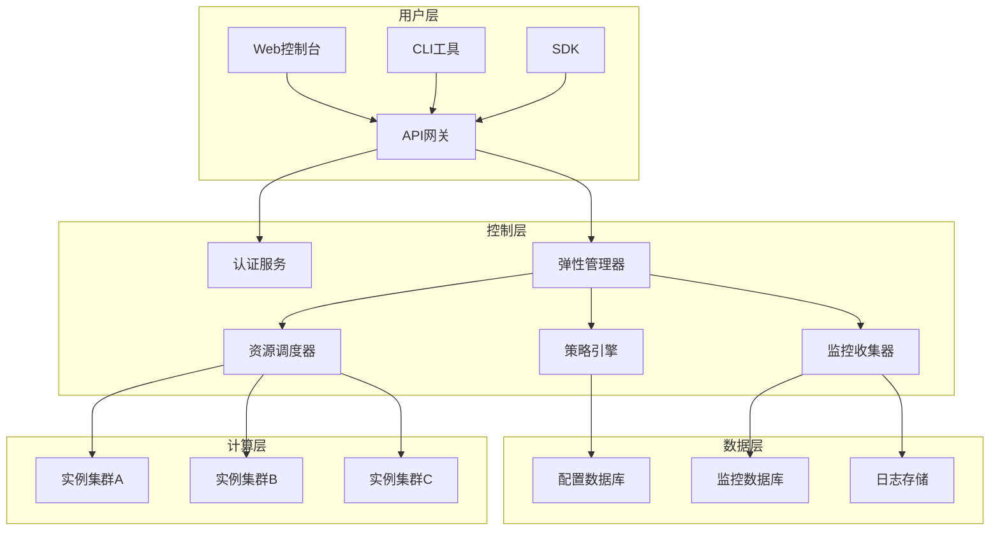
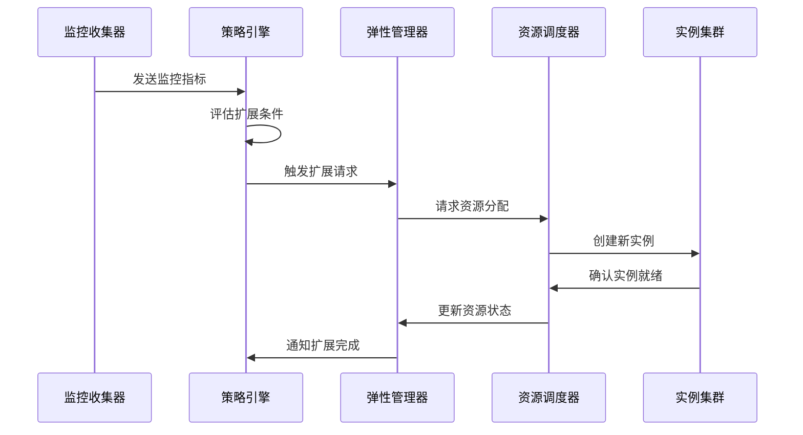
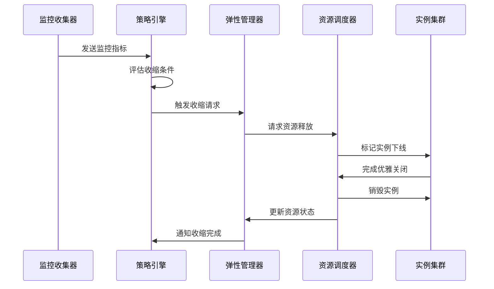

# 架构设计

本文档详细介绍晨羽智云弹性部署的技术架构，包括核心组件、数据流向和扩缩机制。

## 系统架构概览

## 核心组件

### 弹性管理器 (Elastic Manager)
负责协调整个弹性部署系统的核心组件。

**主要职责：**
- 接收和处理扩缩请求
- 协调各个子系统的工作
- 维护系统状态信息
- 处理故障恢复

**关键特性：**
- **高可用性**：支持主备切换
- **分布式架构**：可水平扩展
- **状态管理**：维护一致性状态

### 策略引擎 (Policy Engine)
解析和执行扩缩策略的智能引擎。

**核心算法：**
- **阈值检测**：基于设定阈值触发扩缩
- **趋势分析**：预测负载变化趋势
- **成本优化**：在性能和成本间平衡
- **冷却期管理**：防止频繁扩缩

### 监控收集器 (Metrics Collector)
实时收集和处理系统监控数据。

**数据源：**
- 系统指标（CPU、内存、磁盘、网络）
- 应用指标（请求量、响应时间、错误率）
- 业务指标（用户数、事务量、收益）

**处理流程：**
1. **数据采集**：从多个源收集指标
2. **数据清洗**：过滤异常数据
3. **数据聚合**：计算统计指标
4. **数据存储**：持久化到时序数据库

### 资源调度器 (Resource Scheduler)
负责实际的资源分配和实例管理。

**调度策略：**
- **最佳匹配**：选择最合适的资源池
- **负载均衡**：分散负载到多个实例
- **容错处理**：处理实例故障
- **资源预留**：预留资源应对突发负载

## 扩缩流程

### 扩展流程

### 收缩流程

## 数据流设计

### 实时数据流

### 历史数据流

## 高可用设计

### 组件冗余
- **多副本部署**：关键组件部署多个副本
- **跨区域分布**：组件分布在不同可用区
- **自动故障转移**：检测到故障时自动切换

### 数据一致性
- **分布式锁**：确保扩缩操作的互斥性
- **事务管理**：保证状态变更的原子性
- **数据同步**：多副本间的数据同步

### 容错机制
- **重试机制**：失败操作的自动重试
- **熔断器**：防止故障扩散
- **降级策略**：在故障时提供基本服务

## 安全架构

### 认证授权
- **身份认证**：支持多种认证方式
- **权限控制**：基于角色的访问控制
- **API 安全**：API 密钥和签名验证

### 数据安全
- **传输加密**：HTTPS/TLS 加密传输
- **存储加密**：敏感数据加密存储
- **访问日志**：完整的访问日志记录

### 网络安全
- **VPC 隔离**：网络层面的隔离
- **防火墙规则**：严格的网络访问控制
- **DDoS 防护**：分布式拒绝服务攻击防护

## 性能优化

### 响应时间优化
- **智能预测**：基于历史数据预测负载
- **资源预热**：提前准备资源
- **并行处理**：并行执行扩缩操作

### 吞吐量优化
- **批量操作**：批量处理扩缩请求
- **异步处理**：异步执行耗时操作
- **缓存机制**：缓存常用数据

### 资源利用率优化
- **智能调度**：优化资源分配算法
- **碎片整理**：定期整理资源碎片
- **资源回收**：及时回收未使用资源

## 监控与运维

### 系统监控
- **组件健康状态**：监控各组件运行状态
- **性能指标**：关键性能指标监控
- **业务指标**：业务相关指标监控

### 告警机制
- **多级告警**：不同级别的告警通知
- **智能告警**：基于AI的异常检测
- **告警收敛**：避免告警风暴

### 运维自动化
- **自动部署**：自动化部署流程
- **自动扩缩**：组件自身的自动扩缩
- **自动恢复**：故障的自动恢复

## 下一步

- [配置弹性部署](/elastic-deployment/configuration)
- [监控和告警](/elastic-deployment/monitoring)
- [最佳实践](/elastic-deployment/best-practices) 