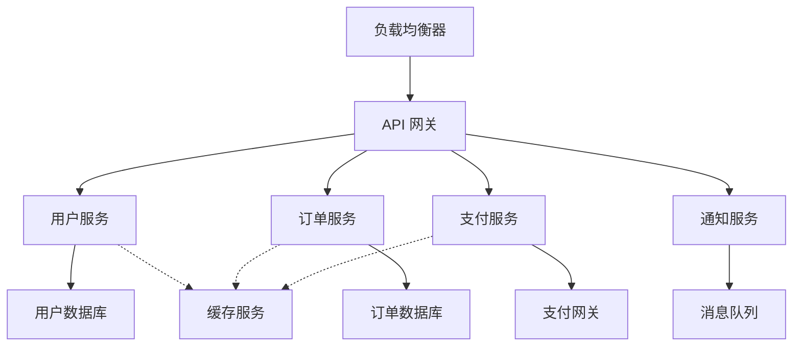
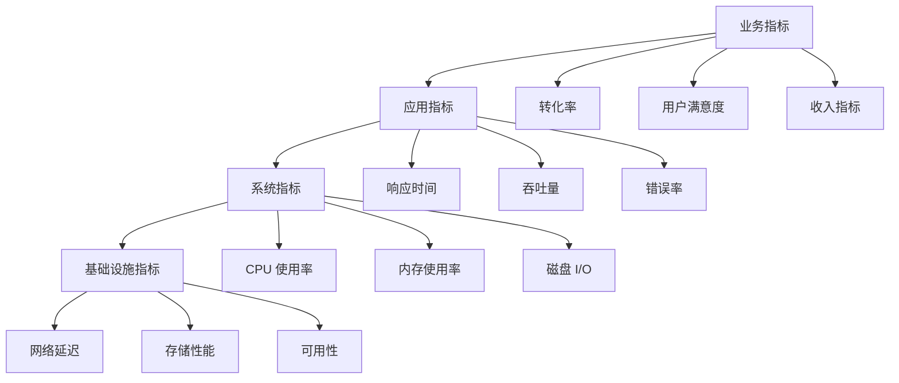
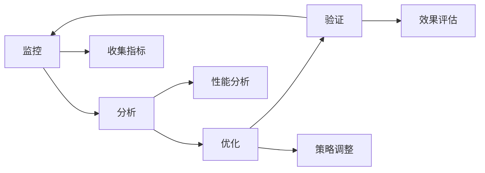

# 最佳实践

本文档总结了弹性部署实施过程中的最佳实践，帮助您构建高效、可靠、经济的弹性部署方案。

## 架构设计最佳实践

### 应用程序设计

<CardGroup cols={2}>
  <Card
    title="无状态设计"
    icon="cube"
  >
    应用程序应设计为无状态，便于水平扩缩
    - 会话信息存储在外部
    - 避免本地文件依赖
    - 使用共享存储或数据库
  </Card>
  <Card
    title="健康检查"
    icon="heart-pulse"
  >
    实现完善的健康检查机制
    - 提供健康检查端点
    - 区分启动检查和运行检查
    - 快速响应健康状态
  </Card>
  <Card
    title="优雅启停"
    icon="power-off"
  >
    支持优雅启动和关闭
    - 处理 SIGTERM 信号
    - 完成当前请求后退出
    - 释放资源和连接
  </Card>
  <Card
    title="配置外部化"
    icon="gear"
  >
    将配置信息外部化
    - 使用环境变量
    - 配置管理服务
    - 避免硬编码配置
  </Card>
</CardGroup>

### 微服务架构

为弹性部署优化微服务架构：



**设计原则：**
- **单一职责**：每个服务专注于特定功能
- **松耦合**：服务间通过 API 通信
- **独立扩缩**：每个服务可独立扩缩
- **故障隔离**：单个服务故障不影响整体

## 扩缩策略最佳实践

### 策略选择指南

<Tabs>
  <Tab title="CPU 密集型应用">
    **推荐策略：**
    - 基于 CPU 使用率的阈值扩缩
    - 垂直扩缩优先，水平扩缩补充
    - 预测性扩缩应对规律性负载
    
    **配置建议：**
    ```json
    {
      "primary_strategy": {
        "type": "cpu_threshold",
        "scale_up_threshold": 70,
        "scale_down_threshold": 30,
        "evaluation_periods": 2
      },
      "secondary_strategy": {
        "type": "predictive",
        "enabled": true,
        "prediction_horizon": 1800
      }
    }
    ```
  </Tab>
  
  <Tab title="内存密集型应用">
    **推荐策略：**
    - 基于内存使用率的阈值扩缩
    - 水平扩缩为主
    - 设置较高的缓冲区
    
    **配置建议：**
    ```json
    {
      "primary_strategy": {
        "type": "memory_threshold",
        "scale_up_threshold": 75,
        "scale_down_threshold": 40,
        "evaluation_periods": 3
      },
      "buffer_settings": {
        "scale_up_buffer": 20,
        "scale_down_buffer": 15
      }
    }
    ```
  </Tab>
  
  <Tab title="IO 密集型应用">
    **推荐策略：**
    - 基于请求队列长度扩缩
    - 响应时间作为辅助指标
    - 快速扩缩响应突发负载
    
    **配置建议：**
    ```json
    {
      "primary_strategy": {
        "type": "queue_length",
        "scale_up_threshold": 100,
        "scale_down_threshold": 20,
        "evaluation_periods": 1
      },
      "secondary_strategy": {
        "type": "response_time",
        "threshold": 500,
        "evaluation_periods": 2
      }
    }
    ```
  </Tab>
</Tabs>

### 参数调优建议

<Warning>
避免过度激进的扩缩策略，可能导致资源浪费和服务不稳定。
</Warning>

#### 阈值设置

1. **CPU 阈值**：
   - 扩展阈值：70-80%
   - 收缩阈值：20-30%
   - 避免 50% 左右的阈值（容易震荡）

2. **内存阈值**：
   - 扩展阈值：75-85%
   - 收缩阈值：40-50%
   - 考虑 GC 和内存碎片

3. **响应时间阈值**：
   - 扩展阈值：SLA 的 70-80%
   - 收缩阈值：SLA 的 30-40%

#### 时间参数

1. **评估周期**：
   - CPU/内存：5-10 分钟
   - 响应时间：2-5 分钟
   - 自定义指标：根据业务特性调整

2. **冷却时间**：
   - 扩展冷却：5-10 分钟
   - 收缩冷却：10-20 分钟
   - 考虑应用启动时间

## 监控和观察性

### 监控指标层次



### 关键指标定义

<Tabs>
  <Tab title="RED 指标">
    **Rate（请求率）**
    - 定义：每秒处理的请求数
    - 用途：衡量系统吞吐量
    - 阈值：根据业务需求设定
    
    **Errors（错误率）**
    - 定义：错误请求占总请求的比例
    - 用途：衡量系统可靠性
    - 阈值：通常 < 0.1%
    
    **Duration（持续时间）**
    - 定义：请求的响应时间
    - 用途：衡量系统性能
    - 阈值：95th percentile < SLA
  </Tab>
  
  <Tab title="USE 指标">
    **Utilization（利用率）**
    - 定义：资源的使用百分比
    - 用途：识别资源瓶颈
    - 阈值：CPU < 80%, 内存 < 85%
    
    **Saturation（饱和度）**
    - 定义：资源队列长度
    - 用途：预测性能问题
    - 阈值：队列长度 < 10
    
    **Errors（错误）**
    - 定义：资源错误计数
    - 用途：识别硬件问题
    - 阈值：错误率 < 0.01%
  </Tab>
  
  <Tab title="业务指标">
    **用户体验指标**
    - 页面加载时间
    - 交易完成时间
    - 用户满意度评分
    
    **业务效率指标**
    - 转化率
    - 平均订单价值
    - 用户留存率
    
    **运营指标**
    - 成本效率
    - 资源利用率
    - SLA 达成率
  </Tab>
</Tabs>

## 成本优化

### 成本控制策略

<CardGroup cols={2}>
  <Card
    title="预留实例"
    icon="bookmark"
  >
    为稳定负载购买预留实例
    - 分析历史使用模式
    - 混合按需和预留实例
    - 定期评估预留策略
  </Card>
  <Card
    title="定时扩缩"
    icon="clock"
  >
    基于业务模式的定时扩缩
    - 工作时间扩展
    - 休息时间收缩
    - 节假日特殊处理
  </Card>
  <Card
    title="资源右调"
    icon="arrows-down-up"
  >
    选择合适的实例规格
    - 避免过度配置
    - 定期评估资源需求
    - 使用性能测试验证
  </Card>
  <Card
    title="多云策略"
    icon="cloud"
  >
    利用多云环境优化成本
    - 比较不同云服务商价格
    - 利用竞价实例
    - 跨区域负载均衡
  </Card>
</CardGroup>

### 成本监控和分析

```json
{
  "cost_monitoring": {
    "metrics": [
      {
        "name": "cost_per_request",
        "formula": "total_cost / total_requests",
        "target": 0.01,
        "alert_threshold": 0.02
      },
      {
        "name": "cost_efficiency",
        "formula": "business_value / total_cost",
        "target": 10,
        "alert_threshold": 5
      },
      {
        "name": "resource_utilization",
        "formula": "used_resources / allocated_resources",
        "target": 0.75,
        "alert_threshold": 0.5
      }
    ],
    "reporting": {
      "daily_cost_report": true,
      "weekly_trend_analysis": true,
      "monthly_optimization_recommendations": true
    }
  }
}
```

## 安全最佳实践

### 访问控制

<Steps>
  <Step title="身份认证">
    - 使用强密码策略
    - 启用多因素认证
    - 定期轮换访问密钥
  </Step>
  <Step title="权限管理">
    - 实施最小权限原则
    - 使用基于角色的访问控制
    - 定期审查权限配置
  </Step>
  <Step title="网络安全">
    - 配置安全组规则
    - 使用 VPC 进行网络隔离
    - 启用 DDoS 防护
  </Step>
  <Step title="数据保护">
    - 加密传输和存储
    - 定期备份数据
    - 实施数据分类策略
  </Step>
</Steps>

### 合规性考虑

- **数据隐私**：遵循 GDPR、CCPA 等法规
- **审计日志**：记录所有操作和访问
- **合规检查**：定期进行安全审计
- **事件响应**：建立安全事件响应流程

## 测试和验证

### 压力测试

进行定期的压力测试验证扩缩策略：

```bash
# 使用 Apache Bench 进行压力测试
ab -n 10000 -c 100 http://your-app.com/

# 使用 JMeter 进行复杂场景测试
jmeter -n -t test-plan.jmx -l results.jtl

# 使用 k6 进行现代化负载测试
k6 run --vus 100 --duration 10m load-test.js
```

### 混沌工程

实施混沌工程验证系统弹性：

```javascript
// 使用 Chaos Monkey 进行随机故障注入
{
  "chaos_experiments": [
    {
      "name": "instance_termination",
      "description": "随机终止实例",
      "frequency": "daily",
      "impact": "terminate_random_instance"
    },
    {
      "name": "network_latency",
      "description": "增加网络延迟",
      "frequency": "weekly",
      "impact": "add_network_latency_100ms"
    },
    {
      "name": "resource_exhaustion",
      "description": "资源耗尽测试",
      "frequency": "monthly",
      "impact": "consume_memory_80_percent"
    }
  ]
}
```

## 团队协作

### 职责分工

<CardGroup cols={2}>
  <Card
    title="开发团队"
    icon="code"
  >
    - 应用程序优化
    - 健康检查实现
    - 性能测试
    - 代码审查
  </Card>
  <Card
    title="运维团队"
    icon="server"
  >
    - 基础设施管理
    - 监控配置
    - 告警处理
    - 容量规划
  </Card>
  <Card
    title="SRE 团队"
    icon="shield"
  >
    - 可靠性工程
    - 自动化工具
    - 事件响应
    - 性能优化
  </Card>
  <Card
    title="产品团队"
    icon="chart-line"
  >
    - 业务需求分析
    - 用户体验监控
    - 成本效益评估
    - 容量预测
  </Card>
</CardGroup>

### 沟通协作

- **定期会议**：每周技术评审，月度容量规划
- **文档管理**：维护运维手册和故障排除指南
- **知识共享**：定期技术分享和最佳实践交流
- **事后复盘**：故障后的复盘和改进

## 持续改进

### 优化循环



### 改进方向

1. **性能优化**：
   - 应用程序性能调优
   - 数据库查询优化
   - 缓存策略优化

2. **成本优化**：
   - 资源配置优化
   - 扩缩策略调整
   - 多云成本比较

3. **可靠性提升**：
   - 故障预防机制
   - 自动恢复能力
   - 灾难恢复计划

4. **用户体验**：
   - 响应时间改善
   - 服务可用性提升
   - 功能稳定性增强

## 常见陷阱和解决方案

<Accordion>
  <AccordionItem title="过度扩缩">
    **问题**：扩缩操作过于频繁，导致资源浪费
    
    **解决方案**：
    - 增加评估周期
    - 设置更合理的阈值
    - 使用预测性扩缩
    - 实施冷却期机制
  </AccordionItem>
  
  <AccordionItem title="扩缩延迟">
    **问题**：扩缩响应延迟，影响用户体验
    
    **解决方案**：
    - 预热实例池
    - 优化应用启动时间
    - 使用更快的存储
    - 实施预测性扩缩
  </AccordionItem>
  
  <AccordionItem title="成本失控">
    **问题**：弹性扩缩导致成本急剧上升
    
    **解决方案**：
    - 设置成本预算和告警
    - 实施最大实例数限制
    - 使用成本优化的实例类型
    - 定期审查和优化策略
  </AccordionItem>
</Accordion>

## 检查清单

使用以下检查清单确保最佳实践的实施：

### 设计阶段
- [ ] 应用程序无状态设计
- [ ] 实现健康检查端点
- [ ] 支持优雅启停
- [ ] 配置外部化

### 配置阶段
- [ ] 选择合适的扩缩策略
- [ ] 设置合理的阈值
- [ ] 配置监控和告警
- [ ] 设置成本限制

### 部署阶段
- [ ] 压力测试验证
- [ ] 监控数据收集正常
- [ ] 告警规则生效
- [ ] 文档更新完整

### 运维阶段
- [ ] 定期性能评估
- [ ] 成本分析和优化
- [ ] 策略调整和改进
- [ ] 团队培训和知识共享

## 下一步

- [故障排除指南](/elastic-deployment/troubleshooting)
- [常见问题解答](/elastic-deployment/faq)
- [回到概述页面](/elastic-deployment/introduction) 