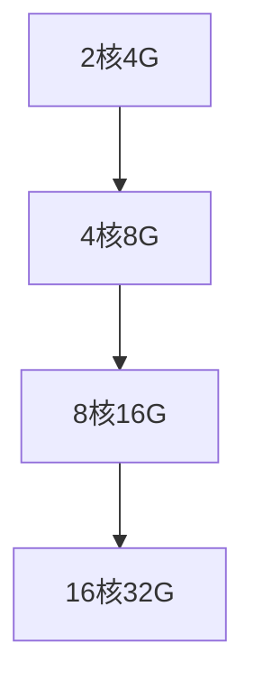

# 基本概念

本文档介绍晨羽智云弹性部署功能的核心概念和术语，帮助您更好地理解和使用弹性部署服务。

## 核心概念

### 弹性实例 (Elastic Instance)
支持动态资源调整的计算实例，能够根据负载自动扩展或收缩资源。

<Note>
弹性实例与普通实例的区别在于其具备自动化的资源管理能力。
</Note>

### 扩缩策略 (Scaling Policy)
定义何时以及如何调整资源的规则集合，包括：

- **扩展策略**：何时增加资源
- **收缩策略**：何时减少资源
- **扩缩幅度**：每次调整的资源量

### 触发条件 (Trigger Conditions)
启动扩缩操作的条件，主要包括：

- **CPU 使用率**：当 CPU 使用率超过或低于阈值时
- **内存使用率**：当内存使用率达到指定水平时
- **请求数量**：基于请求频率的扩缩
- **自定义指标**：基于应用程序特定指标

## 扩缩机制

### 水平扩缩 (Horizontal Scaling)
通过增加或减少实例数量来调整计算能力。

**优势：**
- 更好的容错性
- 支持更大规模的负载
- 成本效益高

**适用场景：**
- Web应用程序
- API服务
- 微服务架构

### 垂直扩缩 (Vertical Scaling)
通过调整单个实例的资源配置（CPU、内存、GPU等）来改变计算能力。

**优势：**
- 配置简单
- 适合单体应用
- 无需重新设计架构

**适用场景：**
- 数据库服务
- 单体应用
- 计算密集型任务

## 监控指标

### 系统指标
- **CPU 利用率**：处理器使用百分比
- **内存使用率**：内存占用情况
- **磁盘 I/O**：磁盘读写速度
- **网络流量**：网络带宽使用情况

### 应用指标
- **请求响应时间**：平均响应延迟
- **错误率**：请求失败百分比
- **吞吐量**：每秒处理的请求数
- **队列长度**：待处理任务数量

### 业务指标
- **并发用户数**：同时在线用户数量
- **事务处理量**：业务事务完成数量
- **收益指标**：与业务收益相关的指标

## 成本模型

### 按需计费
根据实际使用的资源付费，包括：

- **计算资源**：CPU、内存、GPU 使用费用
- **存储资源**：磁盘存储费用
- **网络资源**：带宽使用费用

### 预留实例
预先购买资源获得折扣，适合：

- **稳定负载**：有基础负载保障的应用
- **长期使用**：持续运行的服务
- **成本敏感**：需要降低成本的场景

## 部署模式

### 蓝绿部署 (Blue-Green Deployment)
维护两个完全相同的生产环境，通过切换流量实现零停机部署。

### 滚动部署 (Rolling Deployment)
逐步替换旧版本实例，确保服务连续性。

### 金丝雀部署 (Canary Deployment)
先在小部分用户中测试新版本，然后逐步推广。

## 最佳实践

<Tip>
合理设置触发条件的阈值，避免频繁扩缩造成的抖动。
</Tip>

### 扩缩配置建议

1. **设置合理的缓冲区**：避免在阈值边缘频繁扩缩
2. **考虑启动时间**：新实例启动需要时间，提前触发扩展
3. **设置最小/最大实例数**：防止过度扩展或收缩
4. **监控成本**：定期审查扩缩策略的成本效益

### 应用程序设计

1. **无状态设计**：便于水平扩缩
2. **优雅关闭**：确保实例可以安全地停止
3. **健康检查**：实现应用程序健康状态监控
4. **配置外部化**：使用配置服务而非硬编码

## 下一步

- [了解架构设计](/elastic-deployment/architecture)
- [配置弹性部署](/elastic-deployment/configuration)
- [查看最佳实践](/elastic-deployment/best-practices) 