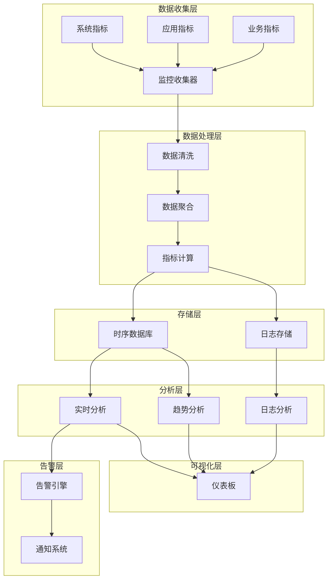

# 监控和告警

有效的监控和告警是成功实施弹性部署的关键。本文档介绍如何配置全面的监控体系和智能告警机制。

## 监控架构



## 监控指标体系

### 基础设施指标

监控计算资源的使用情况：

<Tabs>
  <Tab title="CPU 监控">
    ```json
    {
      "cpu_metrics": {
        "cpu_utilization": {
          "description": "CPU 使用率",
          "unit": "percent",
          "collection_interval": 60,
          "thresholds": {
            "warning": 70,
            "critical": 90
          }
        },
        "cpu_load_average": {
          "description": "CPU 负载均值",
          "unit": "count",
          "collection_interval": 60,
          "thresholds": {
            "warning": 2.0,
            "critical": 4.0
          }
        },
        "cpu_steal_time": {
          "description": "CPU 被窃取时间",
          "unit": "percent",
          "collection_interval": 60,
          "thresholds": {
            "warning": 10,
            "critical": 20
          }
        }
      }
    }
    ```
  </Tab>
  <Tab title="内存监控">
    ```json
    {
      "memory_metrics": {
        "memory_utilization": {
          "description": "内存使用率",
          "unit": "percent",
          "collection_interval": 60,
          "thresholds": {
            "warning": 80,
            "critical": 95
          }
        },
        "memory_available": {
          "description": "可用内存",
          "unit": "bytes",
          "collection_interval": 60,
          "thresholds": {
            "warning": 1073741824,
            "critical": 536870912
          }
        },
        "swap_usage": {
          "description": "交换空间使用率",
          "unit": "percent",
          "collection_interval": 60,
          "thresholds": {
            "warning": 20,
            "critical": 50
          }
        }
      }
    }
    ```
  </Tab>
  <Tab title="存储监控">
    ```json
    {
      "storage_metrics": {
        "disk_utilization": {
          "description": "磁盘使用率",
          "unit": "percent",
          "collection_interval": 300,
          "thresholds": {
            "warning": 80,
            "critical": 90
          }
        },
        "disk_iops": {
          "description": "磁盘 IOPS",
          "unit": "operations/second",
          "collection_interval": 60,
          "thresholds": {
            "warning": 1000,
            "critical": 2000
          }
        },
        "disk_throughput": {
          "description": "磁盘吞吐量",
          "unit": "bytes/second",
          "collection_interval": 60,
          "thresholds": {
            "warning": 104857600,
            "critical": 209715200
          }
        }
      }
    }
    ```
  </Tab>
  <Tab title="网络监控">
    ```json
    {
      "network_metrics": {
        "network_in": {
          "description": "网络入流量",
          "unit": "bytes/second",
          "collection_interval": 60,
          "thresholds": {
            "warning": 104857600,
            "critical": 209715200
          }
        },
        "network_out": {
          "description": "网络出流量",
          "unit": "bytes/second",
          "collection_interval": 60,
          "thresholds": {
            "warning": 104857600,
            "critical": 209715200
          }
        },
        "network_latency": {
          "description": "网络延迟",
          "unit": "milliseconds",
          "collection_interval": 60,
          "thresholds": {
            "warning": 50,
            "critical": 100
          }
        }
      }
    }
    ```
  </Tab>
</Tabs>

### 应用程序指标

监控应用程序的性能和健康状态：

```json
{
  "application_metrics": {
    "response_time": {
      "description": "响应时间",
      "unit": "milliseconds",
      "collection_interval": 30,
      "aggregation": "percentile",
      "percentiles": [50, 95, 99],
      "thresholds": {
        "warning": 500,
        "critical": 1000
      }
    },
    "request_rate": {
      "description": "请求频率",
      "unit": "requests/second",
      "collection_interval": 30,
      "aggregation": "rate",
      "thresholds": {
        "warning": 1000,
        "critical": 2000
      }
    },
    "error_rate": {
      "description": "错误率",
      "unit": "percent",
      "collection_interval": 30,
      "aggregation": "rate",
      "thresholds": {
        "warning": 1,
        "critical": 5
      }
    },
    "throughput": {
      "description": "吞吐量",
      "unit": "transactions/second",
      "collection_interval": 30,
      "aggregation": "rate",
      "thresholds": {
        "warning": 500,
        "critical": 100
      }
    }
  }
}
```

### 业务指标

监控关键业务指标：

```json
{
  "business_metrics": {
    "active_users": {
      "description": "活跃用户数",
      "unit": "count",
      "collection_interval": 60,
      "data_source": "application",
      "query": "SELECT COUNT(DISTINCT user_id) FROM user_sessions WHERE last_activity > NOW() - INTERVAL 5 MINUTE"
    },
    "conversion_rate": {
      "description": "转化率",
      "unit": "percent",
      "collection_interval": 300,
      "data_source": "application",
      "query": "SELECT (COUNT(DISTINCT orders.user_id) / COUNT(DISTINCT visits.user_id)) * 100 FROM visits LEFT JOIN orders ON visits.user_id = orders.user_id WHERE visits.created_at > NOW() - INTERVAL 1 HOUR"
    },
    "revenue_per_hour": {
      "description": "每小时收入",
      "unit": "currency",
      "collection_interval": 300,
      "data_source": "application",
      "query": "SELECT SUM(amount) FROM orders WHERE created_at > NOW() - INTERVAL 1 HOUR"
    }
  }
}
```

## 监控仪表板

### 实时监控仪表板

创建实时监控仪表板：

<CardGroup cols={2}>
  <Card
    title="系统概览"
    icon="server"
  >
    - 实例数量和状态
    - 资源使用率概览
    - 扩缩活动历史
    - 成本统计
  </Card>
  <Card
    title="性能监控"
    icon="chart-line"
  >
    - 响应时间趋势
    - 请求频率变化
    - 错误率统计
    - 吞吐量分析
  </Card>
  <Card
    title="资源使用"
    icon="microchip"
  >
    - CPU 使用率
    - 内存使用率
    - 磁盘使用率
    - 网络流量
  </Card>
  <Card
    title="业务指标"
    icon="chart-bar"
  >
    - 活跃用户数
    - 转化率
    - 收入统计
    - 关键业务指标
  </Card>
</CardGroup>

### 自定义仪表板配置

```json
{
  "dashboard_config": {
    "name": "弹性部署监控",
    "refresh_interval": 30,
    "panels": [
      {
        "title": "实例状态",
        "type": "stat",
        "metrics": ["instance_count", "running_instances", "scaling_instances"],
        "layout": {"x": 0, "y": 0, "w": 6, "h": 4}
      },
      {
        "title": "CPU 使用率",
        "type": "timeseries",
        "metrics": ["cpu_utilization"],
        "time_range": "1h",
        "layout": {"x": 6, "y": 0, "w": 6, "h": 4}
      },
      {
        "title": "内存使用率",
        "type": "timeseries",
        "metrics": ["memory_utilization"],
        "time_range": "1h",
        "layout": {"x": 12, "y": 0, "w": 6, "h": 4}
      },
      {
        "title": "响应时间分布",
        "type": "histogram",
        "metrics": ["response_time"],
        "percentiles": [50, 95, 99],
        "layout": {"x": 0, "y": 4, "w": 12, "h": 4}
      }
    ]
  }
}
```

## 告警配置

### 告警规则

配置智能告警规则：

<Tabs>
  <Tab title="系统告警">
    ```json
    {
      "system_alerts": [
        {
          "name": "high-cpu-usage",
          "condition": "cpu_utilization > 85",
          "duration": "5m",
          "severity": "warning",
          "description": "CPU 使用率持续过高",
          "runbook_url": "https://docs.example.com/runbooks/high-cpu"
        },
        {
          "name": "critical-cpu-usage",
          "condition": "cpu_utilization > 95",
          "duration": "2m",
          "severity": "critical",
          "description": "CPU 使用率极高，可能影响服务",
          "runbook_url": "https://docs.example.com/runbooks/critical-cpu"
        },
        {
          "name": "low-memory",
          "condition": "memory_available < 1GB",
          "duration": "3m",
          "severity": "warning",
          "description": "可用内存不足"
        },
        {
          "name": "disk-full",
          "condition": "disk_utilization > 90",
          "duration": "5m",
          "severity": "critical",
          "description": "磁盘空间不足"
        }
      ]
    }
    ```
  </Tab>
  <Tab title="应用告警">
    ```json
    {
      "application_alerts": [
        {
          "name": "high-error-rate",
          "condition": "error_rate > 5",
          "duration": "3m",
          "severity": "critical",
          "description": "应用错误率过高",
          "annotations": {
            "summary": "应用错误率 {{ $value }}% 超过阈值",
            "description": "在过去 3 分钟内，错误率持续超过 5%"
          }
        },
        {
          "name": "slow-response",
          "condition": "response_time_p95 > 2000",
          "duration": "5m",
          "severity": "warning",
          "description": "响应时间过慢"
        },
        {
          "name": "request-rate-drop",
          "condition": "rate(request_count[5m]) < 10",
          "duration": "2m",
          "severity": "warning",
          "description": "请求量急剧下降"
        }
      ]
    }
    ```
  </Tab>
  <Tab title="扩缩告警">
    ```json
    {
      "scaling_alerts": [
        {
          "name": "scaling-failure",
          "condition": "scaling_operation_failed == 1",
          "duration": "0m",
          "severity": "critical",
          "description": "扩缩操作失败"
        },
        {
          "name": "frequent-scaling",
          "condition": "rate(scaling_events[1h]) > 10",
          "duration": "5m",
          "severity": "warning",
          "description": "扩缩操作过于频繁"
        },
        {
          "name": "max-capacity-reached",
          "condition": "instance_count >= max_instances",
          "duration": "1m",
          "severity": "warning",
          "description": "已达到最大实例数限制"
        }
      ]
    }
    ```
  </Tab>
</Tabs>

### 告警通知配置

配置多种告警通知方式：

```json
{
  "notification_channels": [
    {
      "name": "email-ops",
      "type": "email",
      "config": {
        "smtp_server": "smtp.example.com",
        "smtp_port": 587,
        "username": "alerts@example.com",
        "password": "password",
        "from": "alerts@example.com",
        "to": ["ops@example.com", "admin@example.com"],
        "subject_template": "[{{ .Severity }}] {{ .AlertName }}",
        "body_template": "Alert: {{ .AlertName }}\nSeverity: {{ .Severity }}\nDescription: {{ .Description }}\nTime: {{ .Time }}"
      }
    },
    {
      "name": "slack-ops",
      "type": "slack",
      "config": {
        "webhook_url": "https://hooks.slack.com/services/...",
        "channel": "#ops-alerts",
        "username": "AlertManager",
        "title": "{{ .AlertName }}",
        "text": "{{ .Description }}",
        "color": "{{ if eq .Severity \"critical\" }}danger{{ else }}warning{{ end }}"
      }
    },
    {
      "name": "sms-emergency",
      "type": "sms",
      "config": {
        "provider": "twilio",
        "account_sid": "ACxxxxxxxxxxxxxxxxxxxxxxxxxxxxxxxx",
        "auth_token": "your_auth_token",
        "from": "+1234567890",
        "to": ["+8613800000000", "+8613800000001"],
        "message_template": "{{ .AlertName }}: {{ .Description }}"
      }
    },
    {
      "name": "webhook-integration",
      "type": "webhook",
      "config": {
        "url": "https://api.example.com/alerts",
        "method": "POST",
        "headers": {
          "Content-Type": "application/json",
          "Authorization": "Bearer your_token"
        },
        "body_template": "{\"alert\": \"{{ .AlertName }}\", \"severity\": \"{{ .Severity }}\", \"description\": \"{{ .Description }}\", \"timestamp\": \"{{ .Time }}\"}"
      }
    }
  ]
}
```

## 告警策略

### 告警分级

实施分级告警策略：

```json
{
  "alerting_strategy": {
    "severity_levels": {
      "info": {
        "description": "信息性告警",
        "channels": ["email-ops"],
        "escalation_time": null
      },
      "warning": {
        "description": "警告级告警",
        "channels": ["email-ops", "slack-ops"],
        "escalation_time": "30m"
      },
      "critical": {
        "description": "严重告警",
        "channels": ["email-ops", "slack-ops", "sms-emergency"],
        "escalation_time": "10m"
      }
    },
    "escalation_rules": [
      {
        "condition": "alert_unresolved_for > 30m AND severity == 'warning'",
        "action": "upgrade_to_critical"
      },
      {
        "condition": "alert_unresolved_for > 10m AND severity == 'critical'",
        "action": "notify_on_call_engineer"
      }
    ]
  }
}
```

### 告警抑制

防止告警风暴：

```json
{
  "alert_suppression": {
    "rules": [
      {
        "name": "suppress-derived-alerts",
        "condition": "instance_down == 1",
        "suppress": ["high-cpu-usage", "high-memory-usage", "high-error-rate"],
        "reason": "实例已下线，相关指标告警无意义"
      },
      {
        "name": "suppress-during-scaling",
        "condition": "scaling_in_progress == 1",
        "suppress": ["resource-usage-alerts"],
        "duration": "10m",
        "reason": "扩缩过程中资源使用率波动正常"
      }
    ],
    "throttling": {
      "same_alert_interval": "5m",
      "max_alerts_per_hour": 20
    }
  }
}
```

## 日志监控

### 日志收集配置

```json
{
  "log_collection": {
    "sources": [
      {
        "name": "application-logs",
        "path": "/var/log/app/*.log",
        "format": "json",
        "fields": {
          "timestamp": "@timestamp",
          "level": "level",
          "message": "message",
          "service": "service",
          "instance_id": "instance_id"
        }
      },
      {
        "name": "system-logs",
        "path": "/var/log/syslog",
        "format": "syslog",
        "facility": "system"
      },
      {
        "name": "scaling-logs",
        "path": "/var/log/scaling/*.log",
        "format": "json",
        "fields": {
          "timestamp": "@timestamp",
          "action": "action",
          "instance_id": "instance_id",
          "reason": "reason",
          "result": "result"
        }
      }
    ],
    "processing": {
      "filters": [
        {
          "type": "drop",
          "condition": "level == 'DEBUG'"
        },
        {
          "type": "enrich",
          "field": "geo_location",
          "source": "ip_address"
        }
      ],
      "aggregations": [
        {
          "name": "error_count_by_service",
          "interval": "1m",
          "query": "level:ERROR",
          "group_by": ["service"]
        }
      ]
    }
  }
}
```

### 日志告警

基于日志的告警：

```json
{
  "log_alerts": [
    {
      "name": "high-error-log-rate",
      "query": "level:ERROR",
      "condition": "count > 50",
      "window": "5m",
      "severity": "warning",
      "description": "错误日志频率过高"
    },
    {
      "name": "scaling-failure-detected",
      "query": "action:scale AND result:failed",
      "condition": "count > 0",
      "window": "1m",
      "severity": "critical",
      "description": "检测到扩缩操作失败"
    },
    {
      "name": "memory-leak-pattern",
      "query": "message:*OutOfMemoryError*",
      "condition": "count > 0",
      "window": "1m",
      "severity": "critical",
      "description": "检测到内存泄漏"
    }
  ]
}
```

## 性能分析

### 性能指标分析

```json
{
  "performance_analysis": {
    "metrics": [
      {
        "name": "scaling_efficiency",
        "formula": "successful_scaling_operations / total_scaling_operations",
        "description": "扩缩成功率"
      },
      {
        "name": "response_time_improvement",
        "formula": "(baseline_response_time - current_response_time) / baseline_response_time",
        "description": "响应时间改善比例"
      },
      {
        "name": "cost_per_request",
        "formula": "total_cost / total_requests",
        "description": "每请求成本"
      },
      {
        "name": "resource_utilization_efficiency",
        "formula": "average_resource_utilization / target_resource_utilization",
        "description": "资源利用率效率"
      }
    ],
    "reporting": {
      "daily_report": {
        "enabled": true,
        "time": "09:00",
        "recipients": ["ops@example.com"],
        "metrics": ["scaling_efficiency", "cost_per_request"]
      },
      "weekly_report": {
        "enabled": true,
        "day": "monday",
        "time": "09:00",
        "recipients": ["management@example.com"],
        "metrics": ["all"]
      }
    }
  }
}
```

## 监控最佳实践

### 监控策略

<Tips>
1. **分层监控**：从基础设施到应用程序再到业务指标
2. **适度监控**：避免过度监控导致的信息过载
3. **关联分析**：建立指标间的关联关系
4. **趋势分析**：关注长期趋势而非短期波动
</Tips>

### 告警优化

1. **减少噪音**：避免频繁的无意义告警
2. **分级处理**：根据严重程度分级处理
3. **自动化响应**：对常见问题实现自动化响应
4. **持续优化**：定期审查和优化告警规则

## 故障排除

### 常见监控问题

<Accordion>
  <AccordionItem title="指标收集中断">
    **可能原因：**
    - 监控代理故障
    - 网络连接问题
    - 权限配置错误
    
    **解决方案：**
    - 检查监控代理状态
    - 验证网络连接
    - 确认权限配置
  </AccordionItem>
  
  <AccordionItem title="告警风暴">
    **可能原因：**
    - 告警规则过于敏感
    - 缺乏告警抑制机制
    - 系统故障引发连锁反应
    
    **解决方案：**
    - 调整告警阈值
    - 实施告警抑制
    - 建立告警分级机制
  </AccordionItem>
  
  <AccordionItem title="性能数据异常">
    **可能原因：**
    - 数据收集配置错误
    - 时间同步问题
    - 存储空间不足
    
    **解决方案：**
    - 验证收集配置
    - 同步系统时间
    - 扩展存储空间
  </AccordionItem>
</Accordion>

## 下一步

- [查看最佳实践](/elastic-deployment/best-practices)
- [故障排除指南](/elastic-deployment/troubleshooting)
- [常见问题解答](/elastic-deployment/faq) 