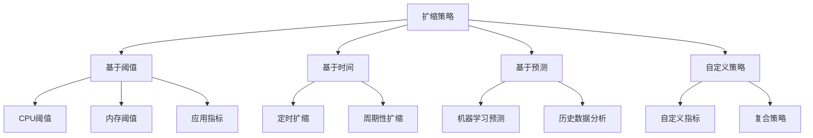

# 扩缩策略

扩缩策略是弹性部署的核心，决定了何时以及如何调整资源。本文档详细介绍各种扩缩策略的配置和最佳实践。

## 策略类型概览



## 基于阈值的扩缩

### CPU 使用率策略

最常用的扩缩策略，基于 CPU 使用率进行资源调整：

```json
{
  "policy_name": "cpu-auto-scaling",
  "type": "threshold",
  "enabled": true,
  "scale_up": {
    "metric": "cpu_utilization",
    "threshold": 75,
    "comparison": "greater_than",
    "evaluation_periods": 2,
    "period": 300,
    "action": {
      "type": "change_in_capacity",
      "value": 1,
      "cooldown": 300
    }
  },
  "scale_down": {
    "metric": "cpu_utilization",
    "threshold": 25,
    "comparison": "less_than",
    "evaluation_periods": 3,
    "period": 300,
    "action": {
      "type": "change_in_capacity",
      "value": -1,
      "cooldown": 600
    }
  }
}
```

**参数说明：**
- `threshold`: 触发阈值
- `evaluation_periods`: 连续触发次数
- `period`: 评估周期（秒）
- `cooldown`: 冷却时间（秒）

### 内存使用率策略

基于内存使用率的扩缩策略：

```json
{
  "policy_name": "memory-auto-scaling",
  "type": "threshold",
  "enabled": true,
  "metrics": [
    {
      "name": "memory_utilization",
      "target_value": 70,
      "scale_up_threshold": 80,
      "scale_down_threshold": 40,
      "evaluation_periods": 2,
      "period": 300
    }
  ],
  "scaling_actions": {
    "scale_up": {
      "adjustment_type": "percent_change_in_capacity",
      "adjustment_value": 50,
      "cooldown": 300
    },
    "scale_down": {
      "adjustment_type": "percent_change_in_capacity",
      "adjustment_value": -25,
      "cooldown": 600
    }
  }
}
```

### 复合指标策略

结合多个指标的扩缩策略：

```json
{
  "policy_name": "composite-scaling",
  "type": "composite",
  "enabled": true,
  "metrics": [
    {
      "name": "cpu_utilization",
      "weight": 0.6,
      "target_value": 70
    },
    {
      "name": "memory_utilization", 
      "weight": 0.3,
      "target_value": 70
    },
    {
      "name": "request_rate",
      "weight": 0.1,
      "target_value": 1000
    }
  ],
  "aggregation_method": "weighted_average",
  "scale_up_threshold": 80,
  "scale_down_threshold": 40
}
```

## 基于时间的扩缩

### 定时扩缩

根据预定时间进行资源调整：

<Tabs>
  <Tab title="工作日模式">
    ```json
    {
      "policy_name": "business-hours-scaling",
      "type": "scheduled",
      "enabled": true,
      "schedules": [
        {
          "name": "scale-up-morning",
          "cron": "0 8 * * MON-FRI",
          "timezone": "Asia/Shanghai",
          "action": {
            "type": "set_desired_capacity",
            "target_capacity": 5
          }
        },
        {
          "name": "scale-down-evening",
          "cron": "0 22 * * MON-FRI",
          "timezone": "Asia/Shanghai",
          "action": {
            "type": "set_desired_capacity",
            "target_capacity": 2
          }
        }
      ]
    }
    ```
  </Tab>
  <Tab title="促销活动">
    ```json
    {
      "policy_name": "promotion-scaling",
      "type": "scheduled",
      "enabled": true,
      "schedules": [
        {
          "name": "pre-promotion-scale-up",
          "start_time": "2024-06-01T09:00:00+08:00",
          "end_time": "2024-06-01T10:00:00+08:00",
          "action": {
            "type": "set_desired_capacity",
            "target_capacity": 10
          }
        },
        {
          "name": "promotion-peak",
          "start_time": "2024-06-01T10:00:00+08:00",
          "end_time": "2024-06-01T14:00:00+08:00",
          "action": {
            "type": "set_desired_capacity",
            "target_capacity": 20
          }
        }
      ]
    }
    ```
  </Tab>
</Tabs>

### 周期性扩缩

基于周期性模式的扩缩：

```json
{
  "policy_name": "periodic-scaling",
  "type": "periodic",
  "enabled": true,
  "patterns": [
    {
      "name": "weekly-pattern",
      "type": "weekly",
      "schedule": {
        "monday": {"morning": 3, "afternoon": 5, "evening": 2},
        "tuesday": {"morning": 3, "afternoon": 5, "evening": 2},
        "wednesday": {"morning": 4, "afternoon": 6, "evening": 3},
        "thursday": {"morning": 4, "afternoon": 6, "evening": 3},
        "friday": {"morning": 5, "afternoon": 8, "evening": 4},
        "saturday": {"morning": 2, "afternoon": 4, "evening": 3},
        "sunday": {"morning": 2, "afternoon": 3, "evening": 2}
      }
    }
  ]
}
```

## 基于预测的扩缩

### 机器学习预测

使用机器学习模型预测未来负载：

```json
{
  "policy_name": "ml-predictive-scaling",
  "type": "predictive",
  "enabled": true,
  "model_config": {
    "model_type": "lstm",
    "prediction_horizon": 3600,
    "training_data_period": 30,
    "retrain_interval": 7,
    "features": [
      "cpu_utilization",
      "memory_utilization",
      "request_count",
      "response_time",
      "hour_of_day",
      "day_of_week",
      "is_holiday"
    ]
  },
  "scaling_config": {
    "buffer_ratio": 0.15,
    "min_scale_up_percent": 10,
    "max_scale_up_percent": 200,
    "confidence_threshold": 0.8
  }
}
```

### 趋势分析

基于历史数据趋势的扩缩：

```json
{
  "policy_name": "trend-based-scaling",
  "type": "trend",
  "enabled": true,
  "analysis_config": {
    "lookback_period": 7200,
    "trend_detection_window": 1800,
    "trend_threshold": 0.1,
    "seasonal_adjustment": true
  },
  "scaling_config": {
    "trend_up_action": {
      "type": "change_in_capacity",
      "value": 1,
      "min_instances": 1,
      "max_instances": 10
    },
    "trend_down_action": {
      "type": "change_in_capacity",
      "value": -1,
      "min_instances": 1,
      "max_instances": 10
    }
  }
}
```

## 自定义策略

### 应用程序指标

基于应用程序特定指标的扩缩：

```json
{
  "policy_name": "application-metric-scaling",
  "type": "custom",
  "enabled": true,
  "custom_metrics": [
    {
      "name": "active_connections",
      "source": "application",
      "endpoint": "/metrics",
      "query": "sum(nginx_connections_active)",
      "target_value": 1000,
      "scale_up_threshold": 1200,
      "scale_down_threshold": 500
    },
    {
      "name": "queue_length",
      "source": "application",
      "endpoint": "/metrics",
      "query": "avg(rabbitmq_queue_messages)",
      "target_value": 100,
      "scale_up_threshold": 150,
      "scale_down_threshold": 50
    }
  ]
}
```

### 业务指标

基于业务指标的扩缩：

```json
{
  "policy_name": "business-metric-scaling",
  "type": "business",
  "enabled": true,
  "business_metrics": [
    {
      "name": "orders_per_minute",
      "source": "database",
      "query": "SELECT COUNT(*) FROM orders WHERE created_at >= NOW() - INTERVAL 1 MINUTE",
      "target_value": 50,
      "scale_up_threshold": 80,
      "scale_down_threshold": 20
    },
    {
      "name": "concurrent_users",
      "source": "redis",
      "query": "ZCARD active_users",
      "target_value": 500,
      "scale_up_threshold": 600,
      "scale_down_threshold": 200
    }
  ]
}
```

## 策略组合

### 优先级策略

配置多个策略的优先级：

```json
{
  "policy_name": "priority-scaling",
  "type": "priority",
  "enabled": true,
  "policies": [
    {
      "name": "emergency-scaling",
      "priority": 1,
      "type": "threshold",
      "metrics": [
        {
          "name": "cpu_utilization",
          "threshold": 95,
          "action": "immediate_scale_up"
        }
      ]
    },
    {
      "name": "predictive-scaling",
      "priority": 2,
      "type": "predictive",
      "enabled": true
    },
    {
      "name": "scheduled-scaling",
      "priority": 3,
      "type": "scheduled",
      "enabled": true
    }
  ]
}
```

### 混合策略

结合多种策略类型：

```json
{
  "policy_name": "hybrid-scaling",
  "type": "hybrid",
  "enabled": true,
  "strategies": [
    {
      "name": "reactive",
      "type": "threshold",
      "weight": 0.5,
      "metrics": ["cpu_utilization", "memory_utilization"]
    },
    {
      "name": "proactive",
      "type": "predictive",
      "weight": 0.3,
      "model_type": "lstm"
    },
    {
      "name": "scheduled",
      "type": "time_based",
      "weight": 0.2,
      "schedules": ["business_hours", "peak_traffic"]
    }
  ],
  "decision_algorithm": "weighted_voting"
}
```

## 策略优化

### 参数调优

<CardGroup cols={2}>
  <Card
    title="阈值调优"
    icon="sliders"
  >
    - 避免设置过于敏感的阈值
    - 考虑应用的正常波动范围
    - 使用历史数据确定合适的阈值
  </Card>
  <Card
    title="冷却时间优化"
    icon="clock"
  >
    - 扩展冷却时间通常较短（5-10分钟）
    - 收缩冷却时间应较长（10-20分钟）
    - 考虑应用启动时间
  </Card>
  <Card
    title="评估周期"
    icon="chart-line"
  >
    - 平衡响应速度和稳定性
    - 通常设置为5-10分钟
    - 根据应用特性调整
  </Card>
  <Card
    title="扩缩幅度"
    icon="arrows-up-down"
  >
    - 避免过度扩缩
    - 考虑成本和性能平衡
    - 设置合理的最大/最小实例数
  </Card>
</CardGroup>

### 性能监控

监控策略执行效果：

```json
{
  "policy_monitoring": {
    "enabled": true,
    "metrics": [
      {
        "name": "scaling_frequency",
        "description": "扩缩操作频率",
        "threshold": 10,
        "period": "1h"
      },
      {
        "name": "scaling_effectiveness",
        "description": "扩缩效果评估",
        "calculation": "target_utilization_achieved / total_scaling_actions"
      },
      {
        "name": "cost_efficiency",
        "description": "成本效益",
        "calculation": "cost_savings / scaling_cost"
      }
    ],
    "alerts": [
      {
        "condition": "scaling_frequency > 20",
        "action": "notify_admin",
        "message": "扩缩频率过高，建议调整策略参数"
      }
    ]
  }
}
```

## 最佳实践

### 策略设计原则

1. **渐进式扩缩**：避免激进的扩缩操作
2. **防止震荡**：设置合适的缓冲区和冷却时间
3. **成本意识**：平衡性能和成本
4. **监控反馈**：持续监控和优化策略

### 常见问题解决

<Accordion>
  <AccordionItem title="频繁扩缩问题">
    **原因**：阈值设置过于敏感或冷却时间过短
    
    **解决方案**：
    - 增加评估周期
    - 设置更大的缓冲区
    - 延长冷却时间
    - 使用复合指标
  </AccordionItem>
  
  <AccordionItem title="扩缩延迟问题">
    **原因**：评估周期过长或预测不准确
    
    **解决方案**：
    - 缩短评估周期
    - 使用预测性扩缩
    - 优化实例启动时间
    - 预留资源池
  </AccordionItem>
  
  <AccordionItem title="成本过高问题">
    **原因**：扩缩策略过于激进或收缩不及时
    
    **解决方案**：
    - 优化扩缩阈值
    - 加快收缩速度
    - 使用更经济的实例类型
    - 实施定时扩缩
  </AccordionItem>
</Accordion>

### 测试和验证

```bash
# 策略测试命令
chenyu-cli scaling test-policy \
  --policy-name cpu-auto-scaling \
  --simulate \
  --duration 3600 \
  --load-pattern spike

# 策略性能分析
chenyu-cli scaling analyze-policy \
  --policy-name cpu-auto-scaling \
  --time-range 24h \
  --metrics efficiency,cost,frequency

# 策略比较
chenyu-cli scaling compare-policies \
  --policy-a cpu-auto-scaling \
  --policy-b ml-predictive-scaling \
  --time-range 7d
```

## 下一步

- [配置监控和告警](/elastic-deployment/monitoring)
- [查看最佳实践](/elastic-deployment/best-practices)
- [故障排除指南](/elastic-deployment/troubleshooting) 