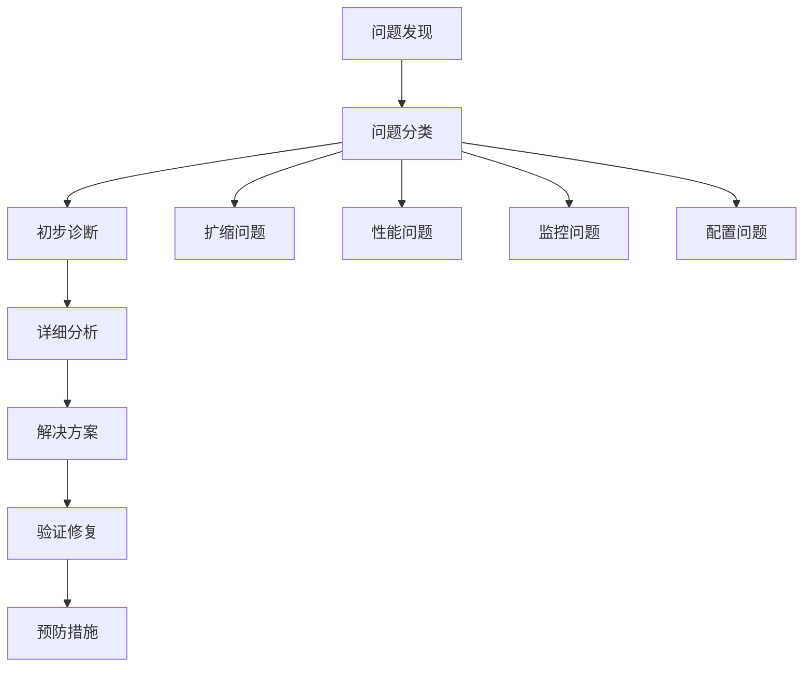

# 故障排除

本文档提供弹性部署常见问题的诊断方法和解决方案，帮助您快速定位和解决问题。

## 故障排除流程



## 扩缩问题

### 扩缩不响应

**症状**：
- 监控显示高负载但没有扩缩
- 扩缩策略已配置但未生效
- 扩缩历史记录为空

**诊断步骤**：

<Steps>
  <Step title="检查策略状态">
    ```bash
    # 检查扩缩策略状态
    chenyu-cli scaling get-policy --instance-id ins-xxxxxxxx
    
    # 检查策略是否启用
    chenyu-cli scaling list-policies --status enabled
    ```
  </Step>
  <Step title="验证监控数据">
    ```bash
    # 检查监控数据收集
    chenyu-cli metrics get --instance-id ins-xxxxxxxx --metric cpu_utilization --duration 1h
    
    # 验证数据完整性
    chenyu-cli metrics validate --instance-id ins-xxxxxxxx
    ```
  </Step>
  <Step title="检查权限配置">
    ```bash
    # 检查服务账户权限
    chenyu-cli auth check-permissions --service scaling
    
    # 验证 API 访问权限
    chenyu-cli auth test-access --resource instances
    ```
  </Step>
</Steps>

**可能原因和解决方案**：

<Tabs>
  <Tab title="策略配置错误">
    **问题**：策略配置有误或被禁用
    
    **解决方案**：
    ```json
    {
      "fixes": [
        {
          "issue": "策略被禁用",
          "solution": "启用扩缩策略",
          "command": "chenyu-cli scaling enable-policy --policy-id policy-xxxxxxxx"
        },
        {
          "issue": "阈值设置错误",
          "solution": "调整触发阈值",
          "example": {
            "scale_up_threshold": 80,
            "scale_down_threshold": 30
          }
        }
      ]
    }
    ```
  </Tab>
  <Tab title="监控数据缺失">
    **问题**：监控数据收集中断
    
    **解决方案**：
    ```bash
    # 重启监控代理
    sudo systemctl restart chenyu-agent
    
    # 检查网络连接
    curl -I https://api.chenyu.cn/v1/metrics
    
    # 验证代理配置
    chenyu-agent config validate
    ```
  </Tab>
  <Tab title="权限问题">
    **问题**：服务账户权限不足
    
    **解决方案**：
    ```bash
    # 更新服务账户权限
    chenyu-cli auth update-permissions \
      --service scaling \
      --permissions "instances:read,instances:write,metrics:read"
    
    # 刷新访问令牌
    chenyu-cli auth refresh-token
    ```
  </Tab>
</Tabs>

### 扩缩操作失败

**症状**：
- 扩缩操作频繁失败
- 实例创建或销毁超时
- 错误日志中显示资源不足

**诊断命令**：

```bash
# 检查扩缩操作历史
chenyu-cli scaling get-history --instance-id ins-xxxxxxxx --limit 50

# 查看失败详情
chenyu-cli scaling get-failure-details --operation-id op-xxxxxxxx

# 检查资源配额
chenyu-cli resource get-quota --region cn-beijing

# 检查实例状态
chenyu-cli instance get-status --instance-id ins-xxxxxxxx
```

**常见错误代码**：

<CardGroup cols={2}>
  <Card
    title="QUOTA_EXCEEDED"
    icon="exclamation-triangle"
  >
    **原因**：超出资源配额限制
    
    **解决方案**：
    - 申请配额增加
    - 调整扩缩策略
    - 清理无用实例
  </Card>
  <Card
    title="INSUFFICIENT_RESOURCES"
    icon="server"
  >
    **原因**：可用区资源不足
    
    **解决方案**：
    - 选择其他可用区
    - 使用不同实例类型
    - 等待资源释放
  </Card>
  <Card
    title="NETWORK_ERROR"
    icon="network-wired"
  >
    **原因**：网络连接问题
    
    **解决方案**：
    - 检查网络配置
    - 验证安全组规则
    - 重试操作
  </Card>
  <Card
    title="PERMISSION_DENIED"
    icon="lock"
  >
    **原因**：权限不足
    
    **解决方案**：
    - 更新访问权限
    - 检查角色配置
    - 验证 API 密钥
  </Card>
</CardGroup>

### 频繁扩缩问题

**症状**：
- 实例频繁创建和销毁
- 扩缩操作间隔过短
- 资源利用率震荡

**分析方法**：

```bash
# 分析扩缩频率
chenyu-cli scaling analyze-frequency \
  --instance-id ins-xxxxxxxx \
  --time-range 24h \
  --threshold 10

# 查看指标波动
chenyu-cli metrics analyze-volatility \
  --instance-id ins-xxxxxxxx \
  --metric cpu_utilization \
  --time-range 6h
```

**解决策略**：

1. **调整评估周期**：
   ```json
   {
     "scaling_policy": {
       "evaluation_periods": 3,
       "period": 600,
       "cooldown": 900
     }
   }
   ```

2. **设置缓冲区**：
   ```json
   {
     "thresholds": {
       "scale_up": 80,
       "scale_down": 30,
       "buffer_zone": 20
     }
   }
   ```

3. **使用复合指标**：
   ```json
   {
     "composite_metrics": {
       "cpu_weight": 0.6,
       "memory_weight": 0.3,
       "request_rate_weight": 0.1
     }
   }
   ```

## 性能问题

### 响应时间异常

**症状**：
- 应用响应时间突然增加
- 用户体验下降
- 错误率上升

**诊断步骤**：

<Accordion>
  <AccordionItem title="应用层分析">
    ```bash
    # 检查应用程序性能
    chenyu-cli app get-performance --instance-id ins-xxxxxxxx
    
    # 分析慢查询
    chenyu-cli app analyze-slow-queries --duration 1h
    
    # 检查内存泄漏
    chenyu-cli app check-memory-usage --instance-id ins-xxxxxxxx
    ```
  </AccordionItem>
  
  <AccordionItem title="系统层分析">
    ```bash
    # 检查系统资源
    chenyu-cli system get-resources --instance-id ins-xxxxxxxx
    
    # 分析 CPU 使用模式
    chenyu-cli system analyze-cpu --time-range 2h
    
    # 检查磁盘 I/O
    chenyu-cli system get-disk-io --instance-id ins-xxxxxxxx
    ```
  </AccordionItem>
  
  <AccordionItem title="网络层分析">
    ```bash
    # 检查网络延迟
    chenyu-cli network check-latency --instance-id ins-xxxxxxxx
    
    # 分析带宽使用
    chenyu-cli network analyze-bandwidth --duration 1h
    
    # 检查连接状态
    chenyu-cli network get-connections --instance-id ins-xxxxxxxx
    ```
  </AccordionItem>
</Accordion>

### 资源利用率异常

**CPU 使用率过高**：

```bash
# 查看 CPU 使用详情
top -p $(pgrep -f your-application)

# 分析 CPU 热点
perf top -p $(pgrep -f your-application)

# 查看线程状态
jstack $(pgrep -f java) | head -50
```

**内存使用异常**：

```bash
# 检查内存使用
free -h
ps aux --sort=-%mem | head -10

# 分析内存分配
jmap -histo $(pgrep -f java) | head -20

# 检查内存泄漏
valgrind --leak-check=full ./your-application
```

**磁盘 I/O 问题**：

```bash
# 检查磁盘使用
df -h
iostat -x 1 10

# 分析 I/O 等待
iotop -o -d 1

# 检查文件系统
fsck /dev/sda1
```

## 监控问题

### 监控数据缺失

**症状**：
- 监控仪表板显示空白
- 告警不触发
- 历史数据丢失

**诊断检查**：

<Tabs>
  <Tab title="数据收集">
    ```bash
    # 检查监控代理状态
    sudo systemctl status chenyu-agent
    
    # 查看代理日志
    journalctl -u chenyu-agent -f
    
    # 测试数据发送
    chenyu-agent test-send --metric cpu_utilization --value 50
    ```
  </Tab>
  <Tab title="网络连接">
    ```bash
    # 检查网络连接
    curl -I https://api.chenyu.cn/v1/metrics
    
    # 测试 DNS 解析
    nslookup api.chenyu.cn
    
    # 检查代理配置
    cat /etc/chenyu-agent/config.json
    ```
  </Tab>
  <Tab title="权限验证">
    ```bash
    # 检查 API 密钥
    chenyu-cli auth validate-key
    
    # 测试权限
    chenyu-cli metrics test-upload --instance-id ins-xxxxxxxx
    
    # 查看权限配置
    chenyu-cli auth get-permissions
    ```
  </Tab>
</Tabs>

### 告警不触发

**可能原因**：

1. **告警规则配置错误**：
   ```json
   {
     "alert_rule": {
       "name": "high-cpu-usage",
       "condition": "cpu_utilization > 80",
       "duration": "5m",
       "enabled": true,
       "notification_channels": ["email", "slack"]
     }
   }
   ```

2. **通知渠道问题**：
   ```bash
   # 测试邮件通知
   chenyu-cli alert test-notification --channel email --recipient test@example.com
   
   # 测试 Slack 通知
   chenyu-cli alert test-notification --channel slack --webhook-url https://hooks.slack.com/...
   ```

3. **数据延迟**：
   ```bash
   # 检查数据延迟
   chenyu-cli metrics check-latency --instance-id ins-xxxxxxxx
   
   # 验证时间同步
   timedatectl status
   ```

## 配置问题

### 配置验证

**配置语法错误**：

```bash
# 验证扩缩策略配置
chenyu-cli config validate --file scaling-policy.json

# 检查监控配置
chenyu-cli config validate --file monitoring-config.json

# 验证告警规则
chenyu-cli config validate --file alert-rules.json
```

**配置冲突检测**：

```bash
# 检查策略冲突
chenyu-cli scaling check-conflicts --instance-id ins-xxxxxxxx

# 验证资源限制
chenyu-cli resource check-limits --instance-id ins-xxxxxxxx

# 检查权限一致性
chenyu-cli auth check-consistency
```

### 配置恢复

**备份和恢复**：

```bash
# 备份当前配置
chenyu-cli config backup --output /tmp/config-backup.json

# 恢复配置
chenyu-cli config restore --input /tmp/config-backup.json

# 查看配置历史
chenyu-cli config get-history --instance-id ins-xxxxxxxx
```

## 日志分析

### 日志收集

**系统日志**：

```bash
# 查看系统日志
journalctl -u chenyu-agent -f

# 查看扩缩操作日志
tail -f /var/log/chenyu/scaling.log

# 查看错误日志
grep "ERROR" /var/log/chenyu/*.log
```

**应用日志**：

```bash
# 查看应用程序日志
tail -f /var/log/your-app/app.log

# 搜索错误信息
grep -i "error\|exception\|failed" /var/log/your-app/*.log

# 分析日志模式
awk '/ERROR/ {print $1, $2, $NF}' /var/log/your-app/app.log
```

### 日志分析工具

使用日志分析工具进行深入分析：

```bash
# 使用 ELK Stack 分析
curl -X GET "elasticsearch:9200/logs/_search?q=level:ERROR&size=100"

# 使用 Grafana 查询
curl -X POST "http://grafana:3000/api/ds/query" \
  -H "Content-Type: application/json" \
  -d '{"queries":[{"refId":"A","expr":"rate(error_count[5m])"}]}'
```

## 性能调优

### 系统优化

**操作系统调优**：

```bash
# 调整文件描述符限制
echo "* soft nofile 65536" >> /etc/security/limits.conf
echo "* hard nofile 65536" >> /etc/security/limits.conf

# 优化网络参数
echo "net.core.rmem_max = 16777216" >> /etc/sysctl.conf
echo "net.core.wmem_max = 16777216" >> /etc/sysctl.conf

# 调整虚拟内存
echo "vm.swappiness = 10" >> /etc/sysctl.conf
```

**应用程序调优**：

```bash
# Java 应用 JVM 调优
export JAVA_OPTS="-Xmx4g -Xms2g -XX:+UseG1GC -XX:MaxGCPauseMillis=200"

# 数据库连接池优化
echo "max_connections = 200" >> /etc/mysql/my.cnf
echo "innodb_buffer_pool_size = 2G" >> /etc/mysql/my.cnf
```

### 监控优化

**指标收集优化**：

```json
{
  "monitoring_optimization": {
    "collection_interval": 60,
    "batch_size": 100,
    "compression": true,
    "sampling_rate": 0.1
  }
}
```

**存储优化**：

```json
{
  "storage_optimization": {
    "retention_period": "30d",
    "compression_level": 6,
    "aggregation_intervals": ["1m", "5m", "1h", "1d"]
  }
}
```

## 应急处理

### 紧急扩缩

**手动扩缩**：

```bash
# 紧急扩容
chenyu-cli scaling manual-scale-up \
  --instance-id ins-xxxxxxxx \
  --target-capacity 10 \
  --reason "emergency_traffic_spike"

# 紧急缩容
chenyu-cli scaling manual-scale-down \
  --instance-id ins-xxxxxxxx \
  --target-capacity 2 \
  --reason "cost_control"
```

### 故障恢复

**自动恢复**：

```bash
# 启用自动恢复
chenyu-cli recovery enable --instance-id ins-xxxxxxxx

# 配置恢复策略
chenyu-cli recovery set-policy \
  --instance-id ins-xxxxxxxx \
  --max-retry 3 \
  --retry-interval 300
```

**手动恢复**：

```bash
# 重启服务
chenyu-cli instance restart --instance-id ins-xxxxxxxx

# 重置配置
chenyu-cli config reset --instance-id ins-xxxxxxxx

# 清理缓存
chenyu-cli cache clear --instance-id ins-xxxxxxxx
```

## 预防措施

### 健康检查

**设置健康检查**：

```json
{
  "health_check": {
    "endpoint": "/health",
    "interval": 30,
    "timeout": 5,
    "healthy_threshold": 2,
    "unhealthy_threshold": 3
  }
}
```

### 备份策略

**配置备份**：

```bash
# 设置自动备份
chenyu-cli backup schedule \
  --instance-id ins-xxxxxxxx \
  --frequency daily \
  --retention 7

# 手动备份
chenyu-cli backup create \
  --instance-id ins-xxxxxxxx \
  --type full
```

### 监控告警

**预警设置**：

```json
{
  "proactive_alerts": [
    {
      "name": "resource-trend-warning",
      "condition": "predict(cpu_utilization, 30m) > 80",
      "severity": "warning",
      "description": "CPU 使用率预计将超过 80%"
    },
    {
      "name": "capacity-planning-alert",
      "condition": "instance_count >= max_instances * 0.9",
      "severity": "info",
      "description": "接近最大实例数限制"
    }
  ]
}
```

## 支持渠道

如果问题仍未解决，您可以通过以下渠道获取帮助：

<CardGroup cols={2}>
  <Card
    title="技术支持"
    icon="headset"
  >
    邮件：support@chenyu.cn
    
    电话：400-123-4567
    
    在线支持：9:00-18:00
  </Card>
  <Card
    title="文档中心"
    icon="book"
  >
    完整文档：docs.chenyu.cn
    
    API 参考：api.chenyu.cn
    
    最佳实践：best-practices.chenyu.cn
  </Card>
  <Card
    title="社区论坛"
    icon="comments"
  >
    技术交流：forum.chenyu.cn
    
    问题反馈：issues.chenyu.cn
    
    功能建议：feedback.chenyu.cn
  </Card>
  <Card
    title="专业服务"
    icon="user-tie"
  >
    架构咨询：consulting@chenyu.cn
    
    培训服务：training@chenyu.cn
    
    企业支持：enterprise@chenyu.cn
  </Card>
</CardGroup>

## 下一步

- [查看常见问题解答](/elastic-deployment/faq)
- [回到最佳实践](/elastic-deployment/best-practices)
- [返回概述页面](/elastic-deployment/introduction) 